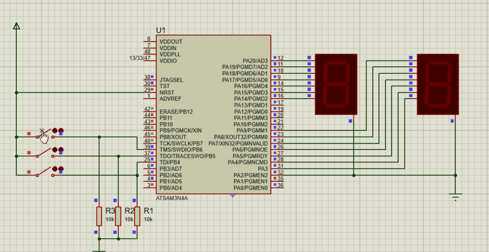

# simple-counter-assembly

This is the final project for Microprocessor and Assembly Language course - Fall 2021.

## About

This project contains the assembly code for a simple two-digits counter and the proteus project file in which I have the circuit simulated. 
Before execution, I compiled the assembly code for ATSAM3N4A micro which is an ARM Cortex M3-based microcontroller and the one I used in my circuit and then, used the `.hex` output in proteus. 
My circuit has three switches, first one starts the counter, second one stops it and the third one resets the counter. 

Here is a short demo of the project:

